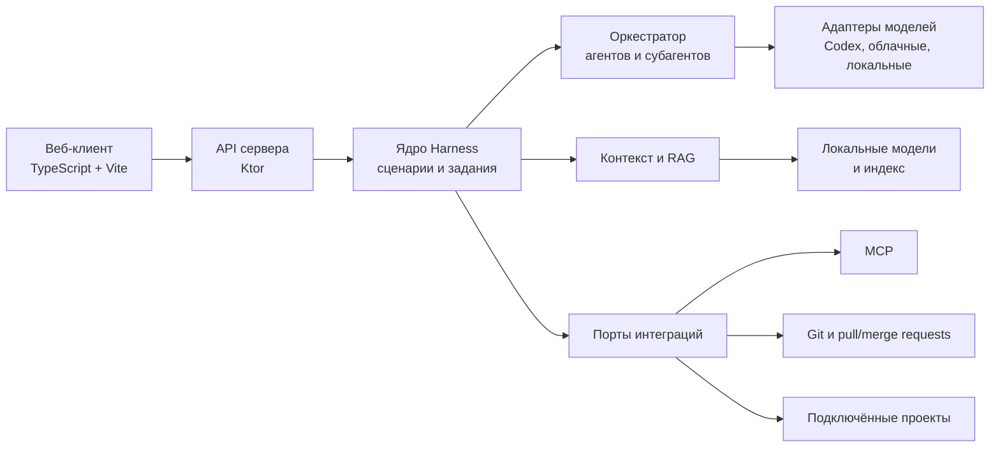

# Архитектура Harness Advent

## Принцип

Harness разделяет предметную логику, выполнение задач и внешние интеграции. Конкретный поставщик модели или система pull request не должен быть частью ядра: он подключается адаптером и может заменяться без переписывания сценариев.

## Компоненты

### Веб-клиент

Будущий модуль `harness-advent-web/` отвечает за интерфейс задач, диалогов, результатов поиска, ревью, разрешений и журналов. Он не запускает команды и не хранит секреты: все привилегированные действия проходят через API сервера.

### API и сервер

Модуль `harness-advent-server/` строится на Kotlin и Ktor. Koin используется для сборки зависимостей, Exposed — для доступа к данным, kotlinx.serialization — для сериализации контрактов. API принимает запросы, авторизует их и создаёт задания; выполнение долгих операций передаётся в слой оркестрации.

### Ядро Harness

Ядро содержит сценарии: вопрос по проекту, RAG-поиск, код-ревью, изменение кода, подготовка pull request и многошаговая реализация. Оно определяет состояния заданий, ограничения, историю и аудит, но не вызывает SDK поставщика напрямую.

### Оркестратор агентов

Оркестратор разбивает сценарий на подзадачи, выдаёт субагентам ограниченный контекст и агрегирует результат. Для каждой подзадачи фиксируются входные данные, выбранный навык, команды, изменения, статус и итоговая проверка. Параллельное выполнение разрешается только для независимых задач.

### RAG и модели

RAG отвечает за извлечение релевантного контекста из разрешённых подключённых проектов и документов. Его индекс, кэш и исходные данные локальны и не коммитятся. Локальные модели — предпочтительный путь для эмбеддингов и поиска; облачные модели используются через отдельные адаптеры после проверки разрешений и политики передачи данных.

### Интеграции

Интеграции оформляются портами и адаптерами:

- модель/агент: запуск, поток событий, отмена, лимиты и учёт использования;
- MCP: обнаружение инструментов, вызов и ограничение прав;
- Git и pull/merge request: чтение, создание веток, комментарии и публикация;
- проекты: чтение файлов, поиск, запуск разрешённых команд и получение статуса.

Публикация комментариев, создание pull request и любые изменения вне рабочей копии должны требовать явного подтверждения пользователя или заранее определённой политики.

## Поток задания

1. Пользователь создаёт сценарий в веб-клиенте.
2. Сервер проверяет доступ, создаёт задание и сохраняет его контекст.
3. Ядро выбирает сценарий, нужные навыки и разрешённые интеграции.
4. Оркестратор выполняет один или несколько шагов, сохраняя события и артефакты.
5. Результат с источниками, изменениями и проверками возвращается в API и отображается в веб-клиенте.

## Инварианты

- Секреты не пересекают границу UI и не записываются в журналы, индекс или Git.
- Внешние побочные эффекты отслеживаемы, ограничены разрешениями и могут быть отменены, если это поддерживается интеграцией.
- Результат RAG содержит ссылки на использованные источники и отделяет факты от выводов агента.
- Навык описывает воспроизводимый способ работы, но не обходные пути для ограничений безопасности.
