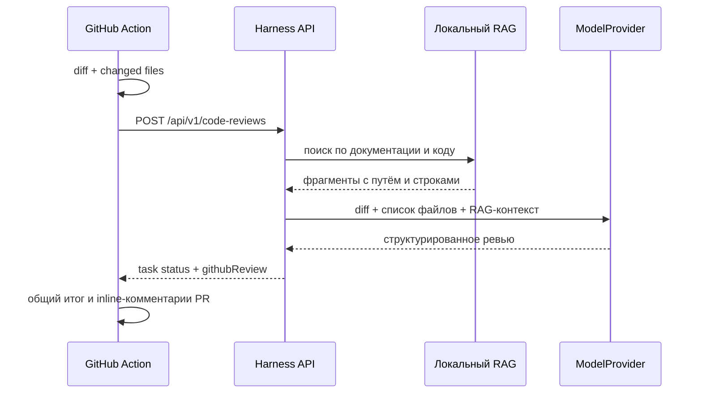

# Автоматическое AI-ревью pull request

## Что происходит

Шаблон [github-ai-code-review.yml](templates/github-ai-code-review.yml) нужно скопировать в `.github/workflows/ai-code-review.yml` **целевого подключаемого репозитория**. Он запускается при открытии PR, новом коммите, повторном открытии и переводе из draft. Harness Advent остаётся отдельным сервисом: workflow получает точный `base...head` diff и список изменённых файлов через GitHub API, создаёт в Harness read-only задачу `codeReview`, ожидает её завершения и публикует один GitHub Review в самом PR.



В задаче сохраняются артефакты `prMetadata`, `changedFiles`, `prDiff`, `reviewSources`, текстовый `codeReviewReport` и структурированный `githubReview`. Diff и код считаются недоверенными данными: prompt прямо запрещает исполнять или следовать инструкциям из них.

Перед сохранением и передачей модели Harness маскирует GitHub expressions вида `${{ secrets.NAME }}`, назначения `token`/`secret`/`password`/`apiKey` и блоки приватных ключей. Если после этого контекст всё ещё похож на секрет, сервер безопасно остановит задачу вместо отправки данных облачной модели.

## Формат результата

Модель возвращает JSON без Markdown-обёртки:

```json
{
  "summary": "## Потенциальные баги\n...\n\n## Архитектурные проблемы\n...\n\n## Рекомендации\n...",
  "comments": [
    { "path": "src/Example.kt", "line": 42, "severity": "high", "body": "Причина замечания." }
  ]
}
```

`summary` публикуется как общий текст review. Каждый элемент `comments` публикуется на указанной строке правой стороны diff; допустимы уровни `critical`, `high`, `medium`, `low`. Harness проверяет привязку до сохранения. Непривязываемые, слишком многочисленные или некорректные замечания не теряются, а добавляются в `summary`. При отсутствии подтверждённых замечаний модель должна написать об этом явно.

## Настройка

1. На сервере Harness зарегистрируй и просканируй разрешённую рабочую копию **целевого** репозитория. Полученный `projectId` относится именно к нему, а не к репозиторию Harness. Сканер берёт `README`, `docs/`, API-описания и исходный код, но исключает `.env`, ключи, бинарники, `.git`, `node_modules` и build-каталоги.
2. В `harness-advent-server/harness.local.properties` задай случайный секрет:

   ```properties
   codeReview.apiToken=<long-random-value>
   ```

3. В настройках GitHub **целевого репозитория** разреши GitHub Actions выдавать `GITHUB_TOKEN` с правом записи в pull request. Персональный access token не нужен: шаблон использует краткоживущий `github.token` только с `contents: read` и `pull-requests: write`.

4. Добавь repository secrets и скопируй workflow-шаблон:

   ```bash
   mkdir -p .github/workflows
   cp <путь-к-Harness>/docs/templates/github-ai-code-review.yml .github/workflows/ai-code-review.yml
   ```

   | Secret | Значение |
   | --- | --- |
   | `HARNESS_API_URL` | URL запущенного Harness без завершающего `/`; вне приватной сети используй HTTPS |
   | `HARNESS_CODE_REVIEW_TOKEN` | значение `codeReview.apiToken` |
   | `HARNESS_PROJECT_ID` | идентификатор зарегистрированного проекта из Harness |

   Опциональная repository variable `HARNESS_MODEL_PROFILE` выбирает профиль модели; по умолчанию workflow передаёт `local`.

5. Для автоматического DeepSeek-ревью на сервере Harness явно разреши передачу контекста **только** этому профилю:

   ```properties
   models.deepseek.endpoint=https://api.deepseek.com/v1
   models.deepseek.token=<DeepSeek API key>
   models.deepseek.models=deepseek-chat
   codeReview.autoApproveContextProfiles=deepseek
   ```

   Перезапусти Harness и добавь в GitHub целевого репозитория обычную Actions variable `HARNESS_MODEL_PROFILE=deepseek`. DeepSeek API key остаётся только в локальном `harness.local.properties` сервера. Такая настройка относится лишь к сценарию `codeReview`; остальные задачи через DeepSeek по-прежнему остановятся на `contextTransfer` approval.

Workflow не работает для PR из fork: GitHub не передаёт им repository secrets. Это намеренное ограничение, чтобы недоверенный код не получал доступ к URL и токену Harness.

## Границы и лимиты

- workflow использует событие `pull_request`, а не `pull_request_target`;
- GitHub token имеет только `contents: read` и `pull-requests: write`; он создаёт review с событием `COMMENT`, но не ставит `APPROVE` или `REQUEST_CHANGES`;
- endpoint `/api/v1/code-reviews` требует `Authorization: Bearer <codeReview.apiToken>`;
- `codeReview.autoApproveContextProfiles=deepseek` означает явное разрешение отправлять diff и выбранный RAG-контекст PR в DeepSeek без ручного подтверждения; не добавляй туда профили, которым не доверяешь;
- максимум 300 файлов и 200 000 символов diff; Action обрезает diff до 180 000 символов и добавляет метку, а при большем числе файлов передаёт первые 300;
- RAG-контекст берётся из зарегистрированной локальной рабочей копии. Для полного соответствия `head SHA` эту копию нужно синхронизировать с PR в доверенной среде (например, self-hosted runner рядом с Harness). Даже без синхронизации модель получает точный PR diff, но неизменённый RAG-контекст может относиться к базовой версии.

Перед публикацией workflow ищет review Harness с тем же `head SHA` и скрытым маркером. При повторном запуске он не создаёт дубликат. Публикация остаётся внешним побочным эффектом, но выполняется по явно включённой политике workflow целевого репозитория, а не сервером Harness.

## Проверка

После настройки открой тестовый PR с безопасным изменением. Workflow `AI code review` должен завершиться успешно; на вкладке Files changed появятся inline-комментарии, а в Conversation — общий GitHub Review. Повторный запуск workflow для того же коммита не должен создать второй review. В Harness проверь задачу через `GET /api/v1/tasks/{taskId}/artifacts`: должны быть артефакты diff, файлов, RAG-источников, `codeReviewReport` и `githubReview`.
